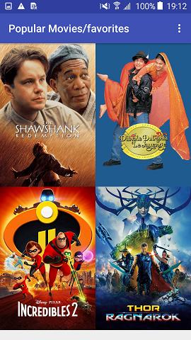

# Popular_Movies_Android_App_stage2
 
>Popular Movies Stage 1&2 is an android app that allows the users to discover the most popular movies playing.
>In the Stage1,the app is arranged by grids. the users can change sort order of movies via a setting: The sort order can be by most popular or by highest-rated.
>By clicking on the movie poster, a detail movie will be display in the screen having the title,image poster, release date, vote average , and the overview of movie.
>in the Stage 2, we added more information to the movie details view which had a list of movie trailers and reviews, and the possibility to make the movie favorite by clicking on favorite icon.
>showing the favorites collection movies in the main view by selecting "favorites" option in the setting menu.

This project was developed as a part of [Android Developer Nanodegree] https://www.udacity.com/course/android-developer-nanodegree-by-google--nd801

##Note:

>The API key that I utilized, has been removed from your code. 
>in order to run the app, You have to add your *API-Key* in the file (../gradle.properties).

## What did I Learn?
Through this project, I learned:
_to create a database to store the movie data of the user's favorite movies.
- to build clean and compelling user interfaces (UIs),
- to fetch data from network services, 
- to get data from database using ContentProvider
- to  optimize the experience for various mobile devices.
- to pass data between  activities.
- to implement adapters and custom list layouts to populate list views.

 
## MIT License

Copyright (c) 2018  Kahina Mouelouel

Permission is hereby granted, free of charge, to any person obtaining a copy of this software and associated documentation files (the "Software"), to deal in the Software without restriction, including without limitation the rights
to use, copy, modify, merge, publish, distribute, sublicense, and/or sell copies of the Software, and to permit persons to whom the Software is furnished to do so, subject to the following conditions:

The above copyright notice and this permission notice shall be included in all copies or substantial portions of the Software.

THE SOFTWARE IS PROVIDED "AS IS", WITHOUT WARRANTY OF ANY KIND, EXPRESS OR IMPLIED, INCLUDING BUT NOT LIMITED TO THE WARRANTIES OF MERCHANTABILITY, FITNESS FOR A PARTICULAR PURPOSE AND NONINFRINGEMENT. IN NO EVENT SHALL THE
AUTHORS OR COPYRIGHT HOLDERS BE LIABLE FOR ANY CLAIM, DAMAGES OR OTHER LIABILITY, WHETHER IN AN ACTION OF CONTRACT, TORT OR OTHERWISE, ARISING FROM, OUT OF OR IN CONNECTION WITH THE SOFTWARE OR THE USE OR OTHER DEALINGS IN THE
SOFTWARE.

## Screenshots

 